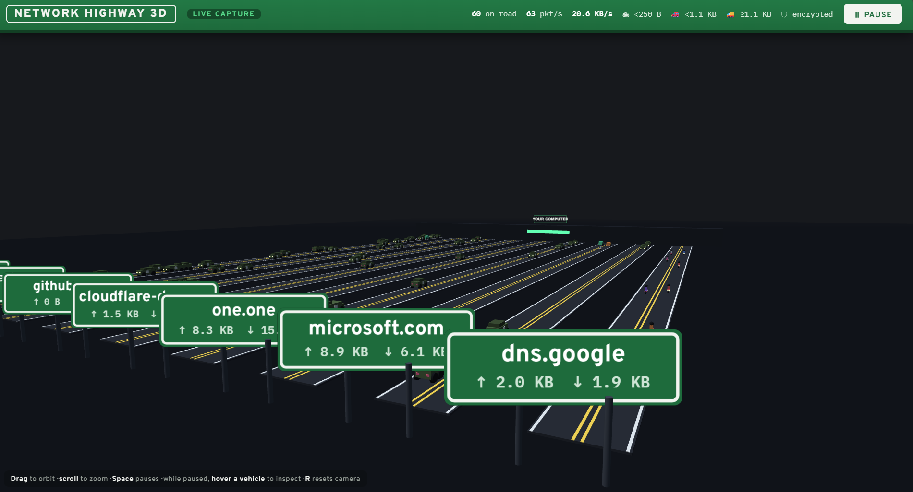

# Network Highway 🛣️

Your live network traffic, drawn as highway traffic in 3D. Every packet is a vehicle, every destination is a road with its own exit sign.

| Network thing | On the highway |
|---|---|
| Packet < 250 B (ACKs, DNS, pings) | 🏍 Motorcycle |
| Packet 250 B – 1.1 KB | 🚗 Car |
| Packet ≥ 1.1 KB (downloads, video) | 🚚 Truck |
| Encrypted traffic (TLS/443, SSH/22, DoT/853…) | 🛡 Armored defense vehicle |
| A burst of packets from one flow | One bigger vehicle (hover shows the packet count) |
| Outgoing packet | Drives away from **YOUR COMPUTER** toward the destination's exit board |
| Incoming packet | Comes back to you on the **same road's** return lane |
| Destination (from TLS SNI or reverse DNS) | Green highway exit sign, e.g. `google.com` |


## Screenshot of Project



## Controls

- **Drag** to orbit the camera, **scroll** to zoom, **R** to reset the view
- **Space** (or the Pause button) freezes traffic
- While paused, **hover any vehicle** to inspect it: direction, IPs, ports, protocol, size/packet count, encryption, timestamp

## Quick start

**1. Backend (captures real packets — needs admin/root):**

```bash
cd backend
pip install -r requirements.txt

# Windows (Admin terminal; install Npcap first from https://npcap.com,
#          tick "WinPcap API-compatible mode" during install)
python capture.py

# Linux / macOS
sudo python3 capture.py
```

**2. Frontend:** double-click `frontend/index.html` (3D). It auto-connects to `ws://localhost:8765` and the badge switches to **LIVE CAPTURE**.

`frontend/index2d.html` is a lightweight 2D version of the same visualizer — handy for weak GPUs or as an OBS overlay.

**No backend? No problem.** If the page can't reach the backend within ~2 seconds it switches itself to **DEMO TRAFFIC** — simulated but realistic flows — so anyone can open the file and see it working instantly. (The 3D page loads Three.js and fonts from CDNs, so it needs internet access the first time.)

## Why it doesn't look like a pile-up

Real traffic is bursty — a single page load can fire 50 packets in 100 ms. Three mechanisms keep the picture readable:

1. **Burst aggregation** — packets from the same flow arriving within ~450 ms merge into one vehicle while it's still near its spawn point. The vehicle grows (car → truck) with the total bytes, and hovering shows how many packets it carries.
2. **Car-following** — every vehicle keeps a safe gap behind its leader in the same lane. Heavy traffic forms visible queues instead of overlapping sprites.
3. **Congestion valve** — if a lane is completely full, new packets merge into the rearmost vehicle rather than spawning more.

## Backend options

```bash
python capture.py --iface "Wi-Fi"        # pick a specific interface
python capture.py --port 9000            # different WebSocket port (update WS_URL in the frontend)
python capture.py --filter "tcp or udp"  # BPF capture filter
python capture.py --loopback             # include 127.0.0.1 traffic
```

List interface names with: `python -c "from scapy.all import get_if_list; print(get_if_list())"`

## How it works

```
┌─────────────────────────┐        WebSocket (JSON,          ┌──────────────────────────┐
│ backend/capture.py      │        batched every 100 ms)     │ frontend/index.html (3D) │
│  scapy AsyncSniffer     │ ───────────────────────────────▶ │  Three.js render loop    │
│  · direction (in/out)   │   {dir, src, dst, ports, proto,  │  · roads per domain      │
│  · TLS SNI extraction   │    size, secure, host, ts}       │  · vehicles per packet   │
│  · cached reverse DNS   │                                  │  · orbit / pause / hover │
└─────────────────────────┘                                  └──────────────────────────┘
```

Domain names come from two sources: the **SNI field** inside outgoing TLS ClientHello packets (exact, e.g. `www.youtube.com`) with **reverse DNS** as fallback. The name is cached per remote IP, which is why reply packets come home on the same road.

Under heavy load the backend trims its queue, the frontend samples spawns, and the aggregation above absorbs the rest — the animation never lags behind reality.

## Customize

All knobs are constants at the top of the `<script>` in `frontend/index.html`:

- `MAX_ROADS` — destination roads before traffic merges into "OTHER TRAFFIC"
- `AGG_WINDOW` / `AGG_ZONE` — how aggressively bursts merge (larger = calmer picture)
- `MAX_PER_LANE`, `MAX_VEHICLES` — congestion caps
- Vehicle size thresholds — `vtypeFor()` · speeds — `SPEEDS` · colors — `CIVILIAN_COLORS`
- Secure ports — `SECURE_PORTS` in `backend/capture.py`

## Troubleshooting

- **No packets / permission error** → run the backend as Administrator (Windows) or with `sudo` (Linux/macOS).
- **Windows: "winpcap is not installed"** → install [Npcap](https://npcap.com) with WinPcap-compatible mode.
- **Wrong interface (LIVE badge but empty roads)** → list interfaces and pass `--iface "Wi-Fi"` / `--iface "Ethernet"`.
- **Badge stuck on DEMO while backend is running** → check the backend printed `ws://localhost:8765`, and that nothing else uses port 8765.
- **Roads show IPs instead of names** → reverse DNS failed for those hosts; names appear once you generate fresh TLS traffic (SNI) to them.
- **3D feels heavy on an old laptop** → use `frontend/index2d.html`.
